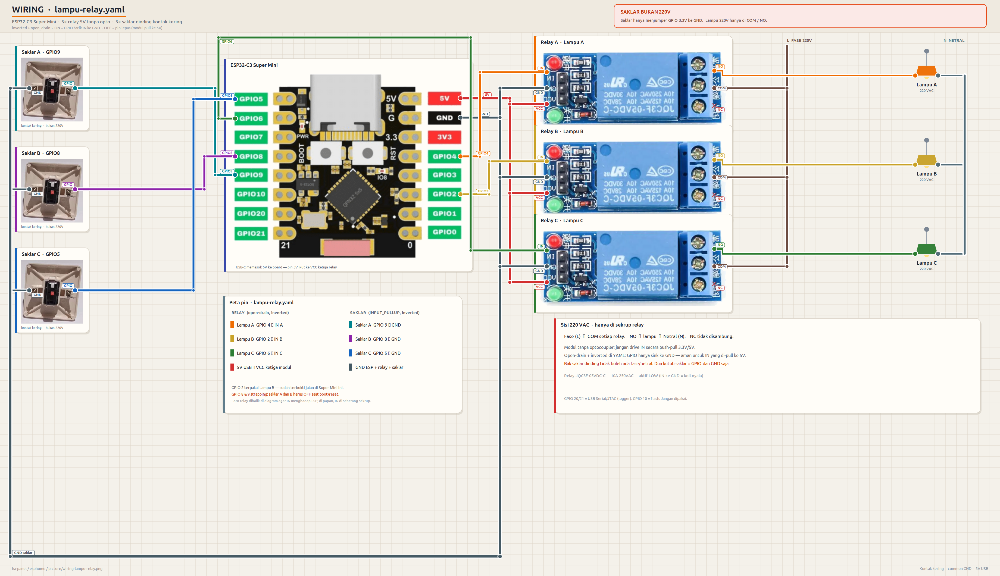
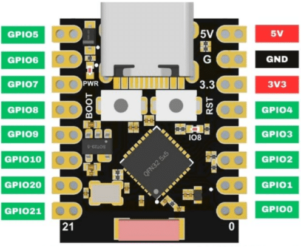
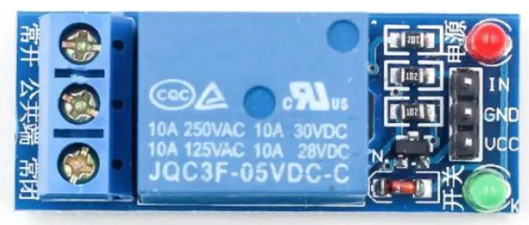
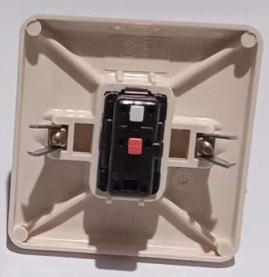

# ESPHome Lampu Relay

Kontrol **3 lampu 220 V** dari Home Assistant, plus **3 saklar dinding fisik**, memakai ESP32-C3 Super Mini dan modul relay 5 V tanpa optocoupler.

Firmware: [ESPHome](https://esphome.io/). Lisensi: [MIT](LICENSE).



## Kenapa open-drain?

Modul relay Songle 5 V tanpa opto menarik pin **IN** ke 5 V lewat LED + resistor. GPIO ESP32-C3 hanya 3.3 V dan tidak boleh didorong HIGH ke bus 5 V.

Solusinya: GPIO **open-drain + inverted**.

| Perintah HA | GPIO | Pin IN relay | Koil |
|---|---|---|---|
| ON | sink ke GND | LOW | nyala |
| OFF | pin dilepas (Hi-Z) | ditarik modul ke 5 V | mati |

Jangan pakai push-pull 3.3 V ke IN. Banyak modul 5 V tanpa opto tidak klik, atau GPIO tertekan ke 5 V.

## Hardware

| Jumlah | Barang | Catatan |
|---|---|---|
| 1 | ESP32-C3 Super Mini | USB-C, 4 MB flash |
| 3 | Relay 5 V 1 channel | JQC3F-05VDC-C, **tanpa** optocoupler, header IN / GND / VCC |
| 3 | Saklar dinding | Kontak kering (2 kutub). Bukan saklar 220 V |
| — | USB-C 5 V | Menyuplai ESP dan VCC ketiga relay |

<p align="center">
  
  
  
</p>

Saklar di foto: dua sekrup kuningan di kiri/kanan rocker. Itu yang dihubungkan ke GPIO dan GND.

## Peta pin

| Fungsi | GPIO | Kabel |
|---|---|---|
| Lampu A → Relay A IN | 4 | oranye |
| Lampu B → Relay B IN | 2 | kuning |
| Lampu C → Relay C IN | 6 | hijau |
| Saklar A | 9 | cyan |
| Saklar B | 8 | ungu |
| Saklar C | 5 | biru |
| VCC ketiga relay | pin **5V** (dari USB-C) | merah |
| GND ESP + relay + saklar | pin **G** | abu-abu |

GPIO **2** dipakai Lampu B dan sudah diuji di Super Mini ini (open-drain ke IN relay).

Jangan pakai:

- **GPIO 10** — CS flash
- **GPIO 20 / 21** — USB Serial/JTAG (logger)

GPIO **8** dan **9** adalah strapping. Saklar A dan B harus **OFF** (tidak ke GND) saat power-on atau reset, kalau tidak board bisa masuk download mode.

## Wiring

Sinyal 3.3 V dan 220 V dipisah total.

**Sisi ESP (aman disentuh):**

1. USB-C 5 V ke Super Mini. Pin **5V** board → **VCC** ketiga relay.
2. **GND** board → **GND** ketiga relay → satu kutub setiap saklar.
3. GPIO 4 / 2 / 6 → **IN** Relay A / B / C.
4. GPIO 9 / 8 / 5 → kutub lain Saklar A / B / C.

**Sisi 220 VAC (hanya di sekrup relay):**

1. Fase (L) → **COM** setiap relay.
2. **NO** → lampu → Netral (N).
3. **NC** tidak disambung.

Di modul fisik, header IN/GND/VCC ada di **seberang** sekrup COM/NO/NC. Diagram membalik foto relay supaya aliran sinyal kiri → kanan.

### Peringatan

- Saklar dinding **bukan** 220 V. Di bak saklar hanya GPIO dan GND.
- 220 V hanya di terminal sekrup relay. Matikan MCB sebelum merakit sisi AC.
- Relay 10 A / 250 VAC. Sesuaikan dengan beban lampu.

## Install

1. Install [ESPHome](https://esphome.io/guides/installing_esphome.html).
2. Salin repo ini, lalu buat secrets:

```bash
cp secrets.yaml.example secrets.yaml
openssl rand -base64 32
```

Isi `wifi_ssid`, `wifi_password`, `ap_password` (min. 8 karakter), dan `api_encryption_key` dari perintah `openssl` di atas.

3. Flash lewat USB-C:

```bash
esphome run lampu-relay.yaml
```

Kalau board tidak ketemu: tahan **BOOT**, colok USB, lepas BOOT, lalu flash lagi.

4. Di Home Assistant: **Settings → Devices & Services → ESPHome** → adopt **Lampu Relay**.

Entity yang muncul:

| Entity | Tipe |
|---|---|
| `switch.lampu_a` / `lampu_b` / `lampu_c` | saklar HA |
| `binary_sensor.saklar_a` / `saklar_b` / `saklar_c` | saklar dinding (toggle relay) |

`restore_mode: RESTORE_DEFAULT_OFF` — setelah reboot, lampu kembali ke state terakhir; jika belum ada state, default OFF.

Fallback Wi-Fi: SSID `Lampu Relay Fallback` (password = `ap_password`) jika router tidak ketemu.

## Ubah pin

Edit blok `switch` dan `binary_sensor` di [`lampu-relay.yaml`](lampu-relay.yaml). Tetap pakai `open_drain` + `inverted: true` untuk IN relay 5 V tanpa opto.

Kalau modul relay **aktif HIGH** (ada opto, IN HIGH = nyala), buang `open_drain` dan `inverted`, lalu cek level dengan multimeter sebelum menyambung 220 V.

## Lisensi

[MIT](LICENSE) © 2026 Wimboro.
